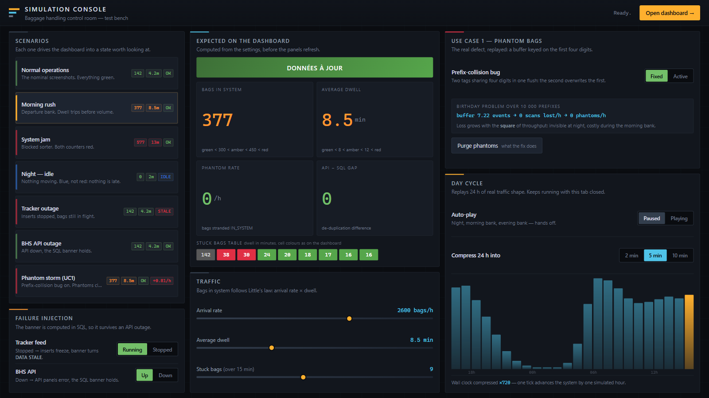

# BHS Software Engineer: Technical Assessment

**A note on language:** since the point is to explain my reasoning and my
choices, the README of each of the two exercises is written in French.
This general README and the deliverables are in English.

Both use cases are covered. Each has its own README, and those are the documents
to read first: the assessment asks for the approach as much as the result, and
that is where the approach lives.

| Use case | Focus | Read |
|---|---|---|
| **1: The Phantom Bag** | Debugging, root cause analysis, monitoring | **[use-case-1-phantom-bag/solution/README.md](use-case-1-phantom-bag/solution/README.md)** |
| **2: The Dashboard Request** | System design, integration, trade-offs | **[use-case-2-dashboard/solution/README.md](use-case-2-dashboard/solution/README.md)** |

**Bonus, outside the scope and the 4 hours of the assessment**: a runnable
simulation of the use case 2 dashboard: a Docker stack and a web console that
drive it through morning rushes, outages and the use case 1 defect, live.
See **[test-bench/README.md](test-bench/README.md)**, or the
[section below](#bonus--simulation-console).

In two sentences each, to set the scene:

- **Use case 1.** The root cause is a non-unique buffer key: the first four
  digits of the `tag_id` are used as a dictionary key, so two bags sharing that
  prefix cannot coexist and the second one silently overwrites the first. The
  fix replaces the dictionary with a list, then secures concurrent flushes
  (atomic buffer swap, two locks, SQLite transaction). Six automated tests cover
  the defect and the concurrency cases.
- **Use case 2.** A dashboard added to the Grafana 9.5 instance already
  deployed, fed by the REST API with SQL Server as a cross-check, and exposed to
  the Office VLAN through an nginx reverse proxy. No application built, nothing
  purchased, ~6 days out of the 10 allowed. The dashboard delivered here was
  imported into a test Grafana, and the two screenshots in the README are real.

## Repository layout

```
├── use-case-1-phantom-bag/
│   ├── (assessment files: bag_tracker.py, sample_logs.txt, ...)
│   └── solution/
│       ├── README.md                 ← analysis and fix
│       ├── bag_tracker_fixed.py      ← corrected code
│       ├── diagrams/                 ← 3 Mermaid diagrams
│       └── tests/                    ← 6 pytest tests
│
├── use-case-2-dashboard/
│   ├── (assessment files: constraints.md, data_sources.md, ...)
│   └── solution/
│       ├── README.md                 ← architecture proposal
│       ├── architecture.md           ← data flows and firewall rules
│       ├── diagrams/                 ← Mermaid data-flow diagram
│       ├── dashboard.json            ← importable into Grafana 9.5
│       ├── apercu-dashboard.html     ← dashboard preview, nothing to install
│       ├── queries.sql               ← corrected SQL queries
│       ├── nginx.conf                ← reverse proxy
│       └── images/                   ← screenshots from the test bench
│
└── test-bench/                       ← BONUS, out of scope (see below)
```

## Bonus: simulation console

**Out of scope, and built outside the 4 hours the assessment allows.** The two
use cases above are the submission; this came after, because a dashboard is
hard to judge from two still images.

[`test-bench/`](test-bench/) is a Docker stack that runs the delivered
`dashboard.json` against a real SQL Server and a mocked BHS API, plus a web
console that drives the simulation: traffic sliders, failure injection, and a
switch that turns the use case 1 bug on and off.



It makes visible what the write-up can only assert: that the banner is backed
by SQL and survives an API outage, that an idle night reads differently from a
broken feed, and that the phantom-bag defect gets worse as throughput rises.
The two screenshots in the use case 2 README were produced with it.

Details and how to run it: [test-bench/README.md](test-bench/README.md).

## Check it for yourself

The use case 1 tests, with no dependency beyond `pytest` (Python 3.12):

```bash
cd use-case-1-phantom-bag/solution && python -m pytest
```

The use case 2 dashboard can be viewed without installing anything, by opening
[apercu-dashboard.html](use-case-2-dashboard/solution/apercu-dashboard.html)
in a browser. To see it in a real Grafana 9.5, `dashboard.json` imports as is
(it expects a SQL Server datasource and the Infinity plugin for the API).

## On the use of AI

The assessment allows it and states that the way it is used will be evaluated.
Both READMEs therefore describe the process as it actually unfolded. I explain
how I used the assistants: independent, cross-checked analyses on use case 1;
reverse reasoning and adversarial analysis on use case 2. I also state what I
kept and what I set aside from what they proposed.
