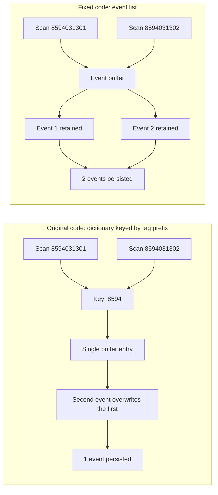

# Root cause and correction

```mermaid
flowchart LR
    subgraph ORIGINAL["Original code: dictionary keyed by tag prefix"]
        A1["Scan 8594031301"] --> K1["Key: 8594"]
        A2["Scan 8594031302"] --> K1
        K1 --> O1["Single buffer entry"]
        O1 --> L1["Second event overwrites the first"]
        L1 --> DB1["1 event persisted"]
    end

    subgraph FIXED["Fixed code: event list"]
        B1["Scan 8594031301"] --> LIST["Event buffer"]
        B2["Scan 8594031302"] --> LIST
        LIST --> E1["Event 1 retained"]
        LIST --> E2["Event 2 retained"]
        E1 --> DB2["2 events persisted"]
        E2 --> DB2
    end
```
