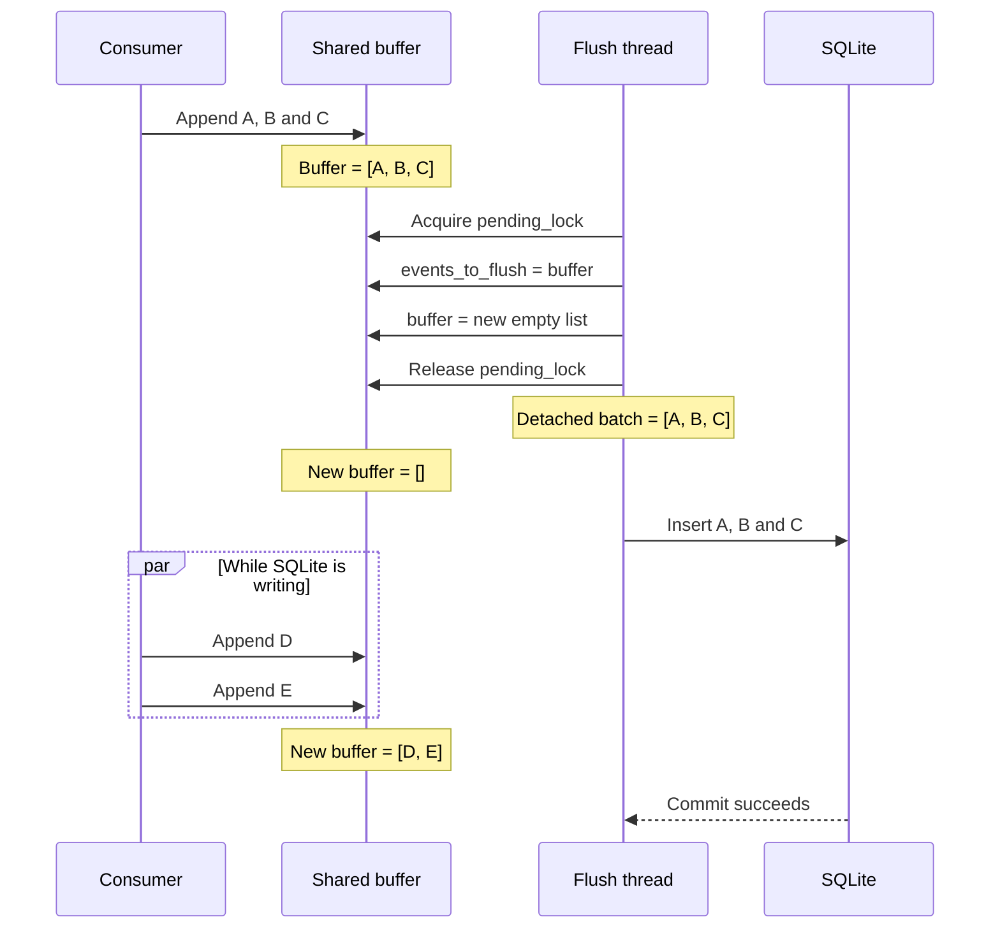
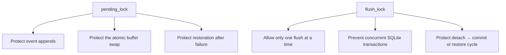

# Atomic buffer swap and lock responsibilities

```mermaid
sequenceDiagram
    participant C as Consumer
    participant B as Shared buffer
    participant F as Flush thread
    participant DB as SQLite

    C->>B: Append A, B and C
    Note over B: Buffer = [A, B, C]

    F->>B: Acquire pending_lock
    F->>B: events_to_flush = buffer
    F->>B: buffer = new empty list
    F->>B: Release pending_lock

    Note over F: Detached batch = [A, B, C]
    Note over B: New buffer = []

    F->>DB: Insert A, B and C

    par While SQLite is writing
        C->>B: Append D
        C->>B: Append E
    end

    Note over B: New buffer = [D, E]
    DB-->>F: Commit succeeds
```

```mermaid
flowchart TD
    P["pending_lock"] --> P1["Protect event appends"]
    P --> P2["Protect the atomic buffer swap"]
    P --> P3["Protect restoration after failure"]

    F["flush_lock"] --> F1["Allow only one flush at a time"]
    F --> F2["Prevent concurrent SQLite transactions"]
    F --> F3["Protect detach → commit or restore cycle"]
```
