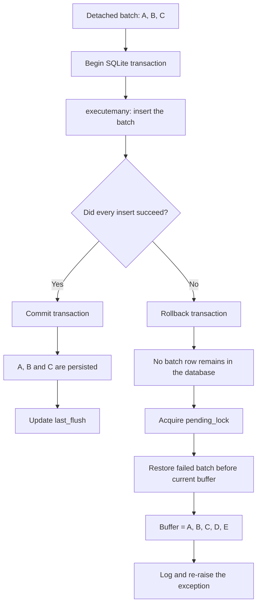

# SQLite transaction and buffer restoration

```mermaid
flowchart TD
    A["Detached batch: A, B, C"] --> T["Begin SQLite transaction"]
    T --> I["executemany: insert the batch"]
    I --> Q{"Did every insert succeed?"}

    Q -->|Yes| C["Commit transaction"]
    C --> S["A, B and C are persisted"]
    S --> M["Update last_flush"]

    Q -->|No| R["Rollback transaction"]
    R --> Z["No batch row remains in the database"]
    Z --> L["Acquire pending_lock"]
    L --> X["Restore failed batch before current buffer"]
    X --> E["Buffer = A, B, C, D, E"]
    E --> G["Log and re-raise the exception"]
```
