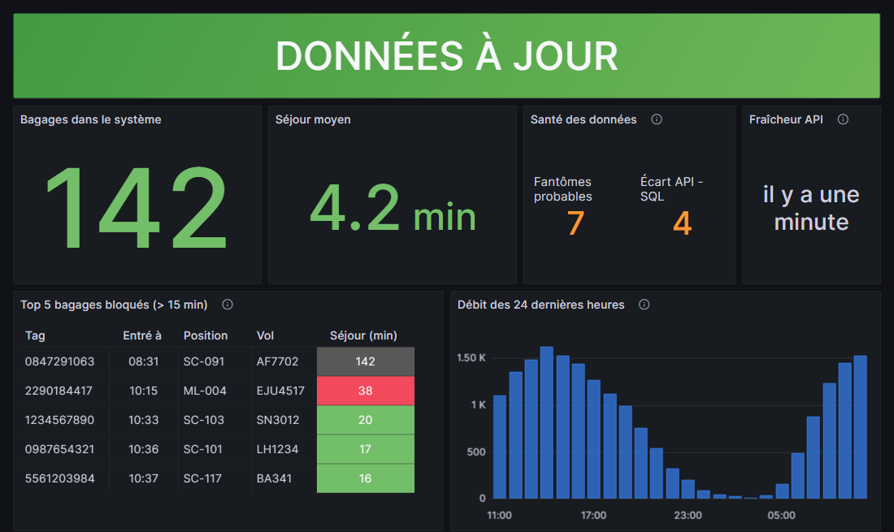
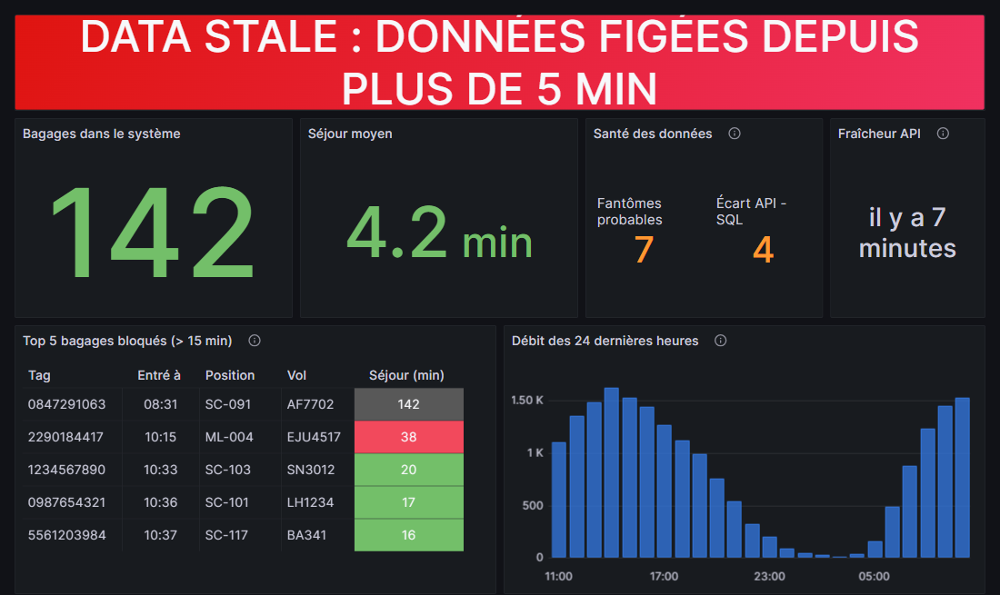

# Use case 2 : Dashboard salle de contrôle NCE

## Résumé

**Proposition** : ajouter un dashboard au **Grafana 9.5 déjà déployé**, alimenté
par l'**API REST** (source primaire) avec **SQL Server** en contre-vérification,
exposé au VLAN Office via un **reverse proxy nginx** (Grafana écoute sur un port
que le firewall bloque). Affichage par le client Dell Wyse en mode kiosk.

**~6 jours** sur les 10 autorisés, zéro achat, zéro nouveau service à exploiter.

---

## 1. Ce que j'ai compris

Trois exigences fonctionnelles simples (compteur + séjour moyen, top 5 bloqués,
débit 24 h) et un affichage passif sur TV murale.

Selon moi, la difficulté n'est pas là :
elle est dans les trois exigences opérationnelles (**reprise automatique après
incident**, **bannière `DATA STALE` au-delà de 5 min**, **aucun credential côté
client**) et dans un firewall qui élimine la moitié des architectures possibles.

Ma lecture : l'exercice teste la capacité à **ne pas over-engineeré** un problème. Trois
nombres, cinq lignes de tableau et un graphique en barres ne justifient pas une
application.

## 2. Le parcours : ce que j'ai écarté, et pourquoi

Sans surprise, le temps étant limité pour l'exercice et ayant accès à l'IA générative, je l'utilise pour présenter le problème mais cette fois-ci en demandant de raisonner à l'envers : quelles solutions NE PAS implémenter et pourquoi.

L'idée étant de dégager la meilleure alternative face à des contraintes fortes, ça me semble la meilleure démarche. De plus, je lance une analyse adversariale et demande finalement de noter sur 10 les solutions proposées (boucle de feedback et auto-évaluation, deux éléments qui permettent d'augmenter la fiabilité des réponses de l'IA générative).

Voici une synthèse **personnelle** des réponses :

**Temps réel via RabbitMQ.** Écarté. Comme le dit l'énoncé, consommer la file *supprime* les messages
(competing consumers) : le dashboard volerait des événements au service de
production. Il faudrait ajouter un consumer dédié RabbitMQ, une intervention sur la prod pour un écran d'affichage. Accessoirement le port 5672 est fermé vers le VLAN Office.

Surtout : **personne n'a besoin du temps réel**. Le tracker insère
par lots toutes les 30 secondes ; rafraîchir plus vite ne montre rien de plus. Le "temps
réel" demandé doit être compris ici comme "ça se met à jour tout seul". Au plus, c'est à clarifier avec le client.

**Requêtes SQL directement depuis le TV.** Écarté. Le port 1433 est ouvert, ce
qui rend l'idée tentante, mais un navigateur ne parle pas SQL nativement et il faudrait un
identifiant SQL côté client, ce qui est explicitement interdit.

**Application web sur mesure (SPA + backend).** Écarté. Le budget le permettrait, surtout que l'on peut rapidement créer de superbes dashboards avec les LLM, mais rien ne le justifie ici : on ajouterait un pipeline de build, un backend et une surface de maintenance permanente pour un écran que personne ne touchera, et où l'efficacité est le mot d'ordre.

Keep it simple, comme on dit.

**Grafana branché tel quel.** C'est le réflexe évident : Grafana est déjà déployé
et exploité pour les métriques PLC, avec mode kiosk et auto-refresh natifs.

**Attention cependant** : Grafana écoute sur le port 3000, or le firewall
Office → BHS n'autorise que 80, 443, 8080 et 1433. Le TV ne peut littéralement
pas l'atteindre.

## 3. La solution retenue : Grafana derrière un reverse proxy

Un nginx sur le serveur monitor proxy le port 80 vers `localhost:3000`. Une
trentaine de lignes de configuration, et toute la chaîne d'affichage (kiosk,
auto-refresh, seuils, alerting) est fournie par un outil que l'équipe exploite
déjà et sait modifier sans développeur.

Détail des flux : [architecture.md](architecture.md), et le
[Schéma 1 : Data flow](diagrams/01-data-flow.md).

**Plan B** : une page HTML statique servie derrière un
endpoint déjà autorisé, qui interroge l'API en direct. Elle est plus simple et
c'est la seule voie à *zéro* changement firewall.

Pourquoi ce n'est pas le plan A ? Avec Grafana, l'équipe exploitation
ajuste seuils et panneaux elle-même, l'alerting est inclus, et le dashboard vit
dans un outil déjà exploité.


*Le [dashboard.json](dashboard.json) livré, importé tel quel dans un Grafana
9.5.15 de test (Docker) : plugin Infinity 2.11.4, API mockée, SQL Server 2019
peuplé de données fictives. Viewport 1100 × 655, celui du kiosk (§7).*

## 4. Sources de données

| Source | Décision | Pourquoi |
|---|---|---|
| **API REST** | **Primaire** | Les trois endpoints couvrent exactement les trois exigences. Surtout, la définition métier de « IN SYSTEM », du séjour et du débit appartient à l'équipe API : la réimplémenter créerait une seconde vérité qui divergera. Charge : ~12 req/min pour un écran, cinq fois sous le rate limit. |
| **SQL Server** | **Secours + contrôle qualité** | Plan B si l'API tombe, détection des bagages fantômes, et surtout **bannière `DATA STALE`** (voir §6). |
| **RabbitMQ** | Écartée | Consommation destructive, port fermé, aucun besoin réel (§2). |

**Ce que j'ai vérifié au passage** : par hypothèse (Cfr mail à Sébastien) et parce qu'il y a des indices que ce sont bien des erreurs, les requêtes SQL « de référence » fournies
dans l'énoncé sont fausses.

- Elles comptent des *événements* et non des *bagages* (pas de déduplication par `tag_id` alors que la table reçoit une ligne par scan).
- Elles comparent des timestamps UTC à `GETDATE()`, qui renvoie l'heure locale, soit deux heures d'erreur en été, de quoi faire paraître tous les bagages bloqués.

Versions corrigées dans [queries.sql](queries.sql). C'est un argument de plus pour
l'API primaire : recalculer une logique métier en SQL peut être source d'erreurs.

## 5. Développer ou réutiliser

**Réutilisé** :

- Grafana et son mode kiosk
- l'utilitaire officiel `grafana-kiosk` pour l'affichage sans intervention
- la datasource SQL Server native
- un plugin JSON gratuit pour l'API
- l'API elle-même, sans modification
- le compte `svc_readonly` (datasource SQL de Grafana, côté serveur)
- le client Dell Wyse et le TV déjà en place
- nginx

**Développé** :

- le dashboard Grafana ([dashboard.json](dashboard.json), du JSON versionné dans Git, aperçu visuel dans [apercu-dashboard.html](apercu-dashboard.html))
- les requêtes SQL de contrôle ([queries.sql](queries.sql))
- trente lignes de configuration nginx ([nginx.conf](nginx.conf))
- le provisionnement du client Dell Wyse

`grafana-kiosk` est distribué en binaire Windows et tourne
sur un Windows 10 IoT du Wyse : il ne reste qu'à le déclarer au démarrage
automatique de la session, avec pour seul paramétrage :

```powershell
grafana-kiosk.windows.amd64.exe `
  -URL "http://monitor.nce-bhs.local/d/bhs-controlroom/salle-de-controle?refresh=30s" `
  -kiosk-mode full `
  -scale-factor 1.75
```

(l'outil ajoute lui-même le mode kiosk à l'URL et pilote le navigateur
Chrome/Edge installé sur le poste ; `-scale-factor` est la façon dont il
répercute le `--force-device-scale-factor` du §7, et donne le viewport logique
de 1100 × 617 dans lequel le dashboard a été conçu).

Aucune application n'est créée. Le seul « code » vivant est de la configuration
versionnée, ce qui veut dire que la reprise par un collègue ne demande pas de
lire un projet.

Simple, efficace et peu couteux.

**Langue de l'écran** : français, parce que les destinataires sont les
opérateurs NCE. Le libellé `DATA STALE` reste tel quel, conformément à
l'énoncé. À confirmer si la salle de contrôle est multilingue : c'est un
`value mapping` à changer, pas une refonte.

## 6. Le point qui m'inquiète le plus : la qualité des données

Le use case 1 montre que le service tracker perd et duplique des événements sous
charge. Ce même tracker alimente la table et, très probablement, l'API.

Par hypothèse, des
bagages restent donc `IN_SYSTEM` indéfiniment : le compteur gonfle, le séjour
moyen dérive, et surtout le **top 5 des bloqués se remplit de faux positifs
permanents**, le pire scénario, parce que c'est ainsi qu'un écran perd la
confiance des opérateurs pour de bon.

Ma position : **le dashboard rend visible, il ne corrige pas.** Le top 5 reste
celui de l'API, cohérent avec les autres outils, et un petit panneau « santé des
données » affiche le nombre de fantômes probables et l'écart entre API et SQL.
S'il monte, les opérateurs le voient, et c'est un argument chiffré pour
prioriser le correctif du tracker.

**Conséquence sur la bannière `DATA STALE`** : je la fais porter par SQL, pas par
l'API, parce qu'il y a deux pannes distinctes. Si l'API meurt, Grafana garde les
dernières valeurs et n'affiche qu'un discret triangle d'erreur (invisible à
trois mètres).

Et si le tracker s'arrête pendant que l'API reste vivante, celle-ci
continue de répondre sur des données mortes. Une requête SQL qui mesure
l'ancienneté du dernier lot inséré détecte les deux cas, et se calcule côté
serveur, donc sans dépendre de l'horloge de la TV.


*Le second mode de panne, reproduit sur le banc de test : inserts arrêtés
depuis plus de 5 min. L'API répond toujours (« 142 bagages », en vert), mais
la bannière SQL a basculé toute seule et rebasculera seule au
rétablissement.*

## 7. Estimation : ~6 jours

- **1 j** : accès, déploiement du proxy, maquette validée avec un opérateur
- **1 j** : configuration Grafana et requêtes SQL revues et testées
- **1 j** : construction du dashboard, seuils, tailles pour une lecture à 3 m
- **1 j** : kiosk avec `grafana-kiosk` sur le client Dell Wyse, redémarrage nocturne, watcher pour redémarrage en cas de crash
- **1 j** : tests de panne (réseau coupé, API tuée, tracker arrêté) et endurance
- **1 j** : recette avec les opérateurs, runbook, transfert

Les quatre jours restants du budget absorbent le délai d'approbation réseau.

Pour la lecture à 3 mètres, je crois qu'il n'y a rien de mieux que la vérification "au jugé".
Cela dit, on pourrait partir de l'explication made by Claude comme première approximation :

Un 55" 16:9 fait 1218 mm de large, soit 0,634 mm/pixel. Pour un confort de lecture (angle visuel ≈ 20′ d'arc), il faut une hauteur de caractère ≥ 3000 × tan(20′) ≈ 17,5 mm, soit ≈ 28 px minimum.

Donc :

- texte de tableau : 32–36 px
- libellés : 40 px
- KPI principaux : 180–220 px

Grafana 9 ne permet pas de régler la taille de police d'un tableau, donc on lance Chrome avec `--force-device-scale-factor=1.75` et on conçoit le dashboard dans un viewport logique de 1100 × 617.

## 8. Risques principaux

| Risque | Mitigation |
|---|---|
| **Grafana 9.5 est en fin de vie** : plus de correctifs de sécurité depuis mi-2024, alors que je propose d'élargir son accès au VLAN Office | Montée de version à proposer |
| Accès anonyme à Grafana : en édition communautaire, un rôle Viewer peut interroger librement les datasources, et les permissions par datasource sont réservées à Enterprise | Compte SQL limité à des vues dédiées, organisation Grafana séparée de celle des dashboards PLC, accès restreint à l'IP du client Dell Wyse |
| Kiosk 24/7 (fuites mémoire, mises à jour Windows) | Redémarrage nocturne planifié, test d'endurance avant mise en service, watcher de relance du service en cas de crash |
| Personne ne surveille l'écran qui surveille | Alerte Grafana si la staleness persiste : un écran mural ne doit pas être le seul témoin de sa propre panne |


## 9. Comment je vérifierais que ça marche

Une partie de cette recette est déjà faite. J'ai importé le dashboard dans un
Grafana 9.5.15 en conteneur, branché sur une fausse API et un SQL Server 2019
peuplé de données de test : ce sont les deux captures ci-dessus, la bannière
`DATA STALE` ayant été déclenchée pour de vrai en arrêtant les insertions.

1. **Exactitude** : comparer les chiffres affichés avec l'API brute et les
   requêtes SQL, sur une heure creuse puis une heure de pointe.
2. **Les deux pannes de fraîcheur, séparément** : API killed, puis tracker arrêté
   avec API vivante. Dans les deux cas la bannière doit apparaître en 5-6 min et
   disparaître seule au rétablissement, vérifié **à trois mètres**, pas sur un
   écran de développeur.
3. **Résilience** : câble réseau débranché, puis coupure d'alimentation du
   client. Le dashboard doit revenir sans clavier ni souris.
4. **Endurance et lisibilité** : 48 h de fonctionnement continu, puis validation
   par deux opérateurs debout devant le vrai écran. Ce sont eux qui recettent.

## 10. Ce que je demanderais avant de démarrer

L'énoncé invite à poser des questions ; voici celles qui conditionnent
réellement le chiffrage et la conception, par ordre d'impact :

1. **Les requêtes SQL « de référence » de l'énoncé sont-elles fausses ?** (§4)
   Je les ai corrigées dans [queries.sql](queries.sql).
2. **La règle firewall vers `monitor:80` est-elle acquise ?** C'est la seule
   dépendance externe du planning ; sans elle, on bascule sur le plan B (§3) et
   le chiffrage change.
3. **« Temps réel » signifie-t-il bien « ça se met à jour tout seul » ?** (§2)
   Si un vrai temps réel est exigé, RabbitMQ revient dans la discussion avec un
   consumer dédié, et ce n'est plus le même projet.
4. **Quelle est l'adresse IP fixe du client Dell Wyse ?** L'allowlist du reverse
   proxy la code en dur ([nginx.conf](nginx.conf)) ; j'ai posé `192.168.10.60`
   par hypothèse, cohérente avec le VLAN Office, mais il faut la confirmer.
5. **Sous quel système tourne le serveur `monitor` ?** Les contraintes le
   donnent comme hôte de Grafana sans préciser son OS, or Docker n'y est
   disponible que sur les serveurs Linux. Si `monitor` est sous Windows, le
   proxy s'installe en service nginx natif plutôt qu'en conteneur : même
   configuration, mais autant le savoir avant d'écrire la procédure.
6. **La salle de contrôle est-elle multilingue ?** (§5) L'écran est en
   français ; c'est un `value mapping` à changer.
7. **L'état `IDLE` la nuit est-il acceptable pour les opérateurs ?** (§6) Sans
   trafic, une lecture stricte du « au-delà de 5 min » afficherait `DATA STALE`
   toute la nuit ; j'ai prévu un état distinct, à valider par ceux qui regardent
   l'écran.
8. **Qui reçoit l'alerte quand l'écran lui-même tombe ?** (§8) Un écran mural
   ne doit pas être le seul témoin de sa propre panne.

---

**Livrables** :

- ce README
- [architecture.md](architecture.md) (flux et règles firewall) et son [schéma](diagrams/01-data-flow.md)
- [queries.sql](queries.sql) (requêtes corrigées)
- [dashboard.json](dashboard.json) (dashboard importable dans Grafana 9.5)
- [apercu-dashboard.html](apercu-dashboard.html) (aperçu visuel du dashboard, données fictives)
- [nginx.conf](nginx.conf) (reverse proxy)
