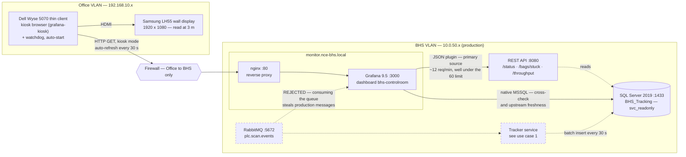

# Data flow — control room dashboard

```mermaid
flowchart LR
    subgraph OFFICE["Office VLAN — 192.168.10.x"]
        direction TB
        WYSE["Dell Wyse 5070 thin client<br/>kiosk browser (grafana-kiosk)<br/>+ watchdog, auto-start"]
        TV["Samsung LH55 wall display<br/>1920 x 1080 — read at 3 m"]
        WYSE -->|HDMI| TV
    end

    FW{{"Firewall — Office to BHS only"}}

    subgraph BHS["BHS VLAN — 10.0.50.x (production)"]
        subgraph MONITOR["monitor.nce-bhs.local"]
            NGINX["nginx :80<br/>reverse proxy"]
            GRAFANA["Grafana 9.5 :3000<br/>dashboard bhs-controlroom"]
            NGINX --> GRAFANA
        end
        API["REST API :8080<br/>/status · /bags/stuck · /throughput"]
        SQL[("SQL Server 2019 :1433<br/>BHS_Tracking — svc_readonly")]
        TRACKER["Tracker service<br/>see use case 1"]
        MQ["RabbitMQ :5672<br/>plc.scan.events"]
    end

    WYSE -->|"HTTP GET, kiosk mode<br/>auto-refresh every 30 s"| FW
    FW --> NGINX
    GRAFANA -->|"JSON plugin — primary source<br/>~12 req/min, well under the 60 limit"| API
    GRAFANA -->|"native MSSQL — cross-check<br/>and upstream freshness"| SQL
    MQ -.-> TRACKER
    TRACKER -.->|"batch insert every 30 s"| SQL
    API -.->|reads| SQL

    MQ -.->|"REJECTED — consuming the queue<br/>steals production messages"| GRAFANA

    classDef outofscope stroke-dasharray: 5 5
    class MQ,TRACKER outofscope
```
